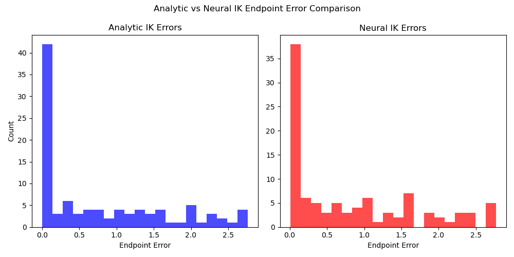

# Kinematics 3-DOF Arm

## What does this project do?
This project builds a Forward and Inverse Kinematics solver for a 
3-joint planar robot arm. 
Forward Kinematics: It would calculate the position and orientation of end-effector based on known joint angles using D-H parameters
Inverse Kinematics: To calculate the necessary joint angles to move the robot's end effector to a specific target

## Project Structure
- `kinematics/` — has equations and robot parameters
- `ml/` — the model that learns the movement
- `viz/` — visualization of the arm robot
- `tests/` — unit tests to verify FK and IK correctness
- `notebooks/` — results, plots, analysis

## Neural IK
It takes data from Ik_analytic and trains it with 3 hidden layers using MSE loss and adam optimizer. Tried it with forward kinematics but end effector position can give multiple different solution, the best results got form IK_analytic. Through model , i got 0.0002 loos and it matched analytic IK solution closely.

## Results

- Analytic IK mean error: 0.76
- Neural IK mean error: 0.88

## Limitations
- 2 hidden layers were insufficient — 3 hidden layers with 128 neurons achieved loss of 0.0002
- FK-generated dataset failed due to multiple IK solutions for same end effector position
- Neural IK assumes theta3 is handled via phi — true 6-DOF IK would need a different approach

## What I will learn
- Denavit-Hartenberg parameters
- Rotation matrices and transform chaining
- Analytical vs neural IK comparison

## References
- Modern Robotics — Lynch & Park: https://modernrobotics.org


## Running Tests
```bash
python3 -m pytest tests/ -v
```
